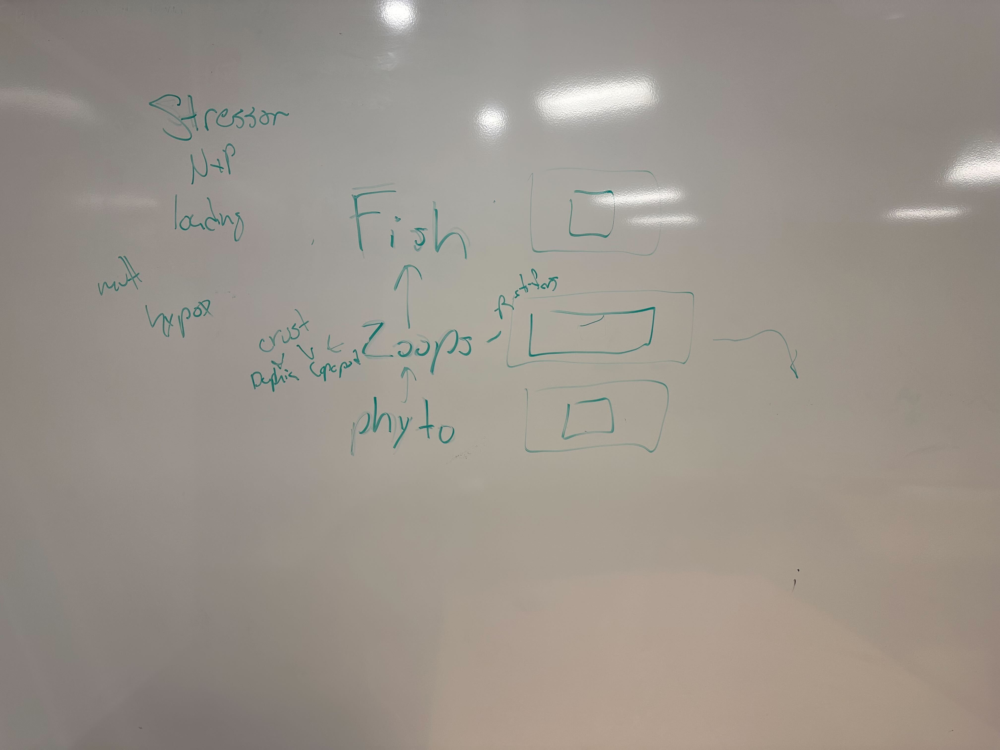
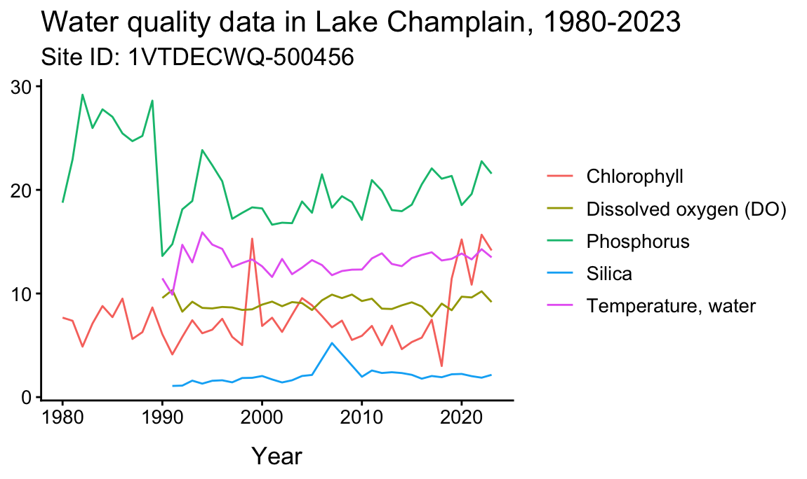
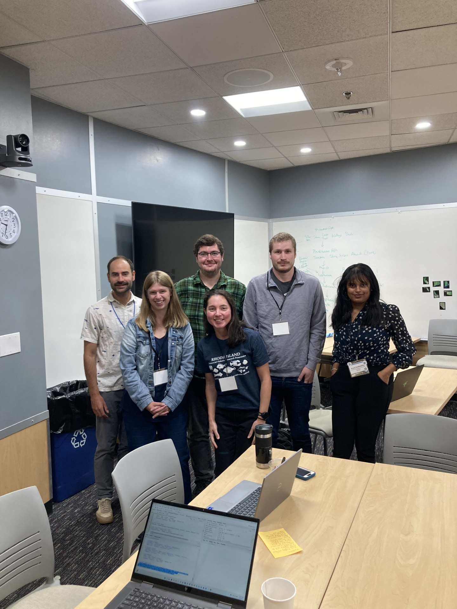

# Stressors, Food Web Connectivity, and Stability

<a href="https://github.com/CU-ESIIL/stressors-food-web-connectivity-stability-innovation-summit-2025__4/edit/main/docs/index.md" title="Edit this page">✏️</a>

<!-- =========================================================
HERO (Swap hero.jpg, title, strapline, and the three links)
========================================================= -->

[Raw photo location: 20200729_145101.jpg](https://github.com/CU-ESIIL/stressors-food-web-connectivity-stability-innovation-summit-2025__4/blob/main/docs/assets/20200729_145101.jpg)
Photo Credit: Symons Lab, UCI

**One sentence on impact:** In three days, we probe how interacting stressors rewire aquatic food-web connections and highlight stability signals that managers can act on.

**[Project brief (PDF)](assets/Seven%20ways%20to%20measure%20fire%20polygon%20velocity-4.pdf) · [View shared code](https://github.com/CU-ESIIL/stressors-food-web-connectivity-stability-innovation-summit-2025__4/blob/main/code/fired_time_hull_panel.ipynb) · [Explore data](https://github.com/CU-ESIIL/stressors-food-web-connectivity-stability-innovation-summit-2025__4/blob/main/code/prism_quicklook.py)**

> **About this site:** This is a public, in-progress record of a 3-day project at the Innovation Summit. Edit everything here in your browser: open a file → pencil icon → Commit changes.

---

## How to use this page (for the team)
- **Edit this file:** `docs/index.md` → ✎ → change text → **Commit changes**.
- **Add images:** upload to `docs/assets/` and reference like `assets/your_file.png`.
- Keep **text short** and **visuals first**. Think “slide captions,” not essays.

---

## Day 1 — Define & Explore
*Focus: questions, hypotheses, context; add at least one visual (photo of whiteboard/notes).*

### Our product 📣
- Future publication
- Conceptual progress towards an ESIIL Working Group application

### Our question(s) 📣
- How do multiple stressors impact food web connectivity in aquatic systems, and at what threshold of connectivity do we pass a tipping point?
- Can food web connectivity be used as a predictor of tipping points?
- Does relative abundance at each trophic level signal tipping points?

### Hypotheses / intentions [Optional: probably not relevant if you are creating an educational tool]
- If the number of food web connections approximates stability, then loss of some number of connections over a threshold will result in a significantly different food web composition.
- Addition of multiple stressors will lead to a switch in trophic cascade structure (bottom-up versus top-down systems).
- Addition of multiple stressors will shift food webs to contain a higher proportion of generalist species. 

### Why this matters (the “upshot”) 📣
Aquatic places have a lot of value - food, recreation, biodiversity, and more. Freshwater lakes are under threat from multiple stressors including changing temperatures, pH, nutrients, invaisve species, and human impact, which threaten those values.

### Inspirations (papers, datasets, tools)
- Vermont Department of Environmental Conservation/EPA water quality datasets: [Lake Champlain data](https://anrweb.vermont.gov/dec/_dec/LongTermMonitoringLakes.aspx?_gl=1*1gvj1mr*_ga*ODAxMzU1NjYwLjE3NTg2NTY5NTk.*_ga_V9WQH77KLW*czE3NTg2NTY5NTkkbzEkZzEkdDE3NTg2NTcyNzYkajYwJGwwJGgw)

### Field notes / visuals
<!-- EDIT: Replace with a real smartphone photo or sketch; keep filename simple. -->

[Raw photo location: day1_whiteboard.jpg](https://github.com/CU-ESIIL/stressors-food-web-connectivity-stability-innovation-summit-2025__4/blob/main/docs/assets/whiteboard_9-23-25.jpg)
*Initial whiteboard brainstorm of a basic foodweb*

> **Different perspectives:** Briefly capture disagreements or alternate framings. These can unlock innovation.

---

## Day 2 — Data & Methods
*Focus: what we’re testing and building; show a first visual (plot/map/screenshot/GIF).*

### Data sources we’re exploring 📣
<!-- EDIT: Link each source; add size/notes if relevant. -->
- Vermont Department of Environmental Conservation/EPA water quality datasets: [Lake Champlain data](https://anrweb.vermont.gov/dec/_dec/LongTermMonitoringLakes.aspx?_gl=1*1gvj1mr*_ga*ODAxMzU1NjYwLjE3NTg2NTY5NTk.*_ga_V9WQH77KLW*czE3NTg2NTY5NTkkbzEkZzEkdDE3NTg2NTcyNzYkajYwJGwwJGgw) Physical, chemical, and biological observations including nutrients, temperature, pH, dissolved oxygen, and biological species

### Methods / technologies we’re testing 📣
- Parameterize a simulated food web using observed data from Lake Champlain.
- In simulated model, introduce stressors such as changes to temperature, pollution (e.g., nutrients), invasive species, etc.
- Calculate food web metrics such as connectivity, number of nodes, stability, etc. before and after introduction of stressors.
- Determine if and where thresholds exist before food web metrics display food web collapse.

### Challenges identified
- Data gaps / quality issues:
  1. Site IDs don't seem to match to consistent locations.
  2. Site IDs are differen't between the Vermont DEC website and the EPA API (where we actually stream data from), making it difficult to get a handle on what sites we are looking at.
  3. Zooplankton is missing from the Lake Champlain dataset, which are crucial taxa to include in a freshwater food web.
- Method limitations / compute constraints
  1. How do we make a basic, but also realistic, simulated food web to test effects of stressors?
- Open questions we need to decide on
  1. How complex of a food web do we simulate?
  2. Which stressors do we include in the system?
  3. Do we expand outside of Lake Champlain? If so, where do we find those data?

### Visuals
<!-- EDIT: Swap examples; keep file sizes modest. -->
#### Static figure

[Raw photo location: lc_water_quality.png](https://github.com/CU-ESIIL/stressors-food-web-connectivity-stability-innovation-summit-2025__4/blob/main/docs/assets/lc_water_quality.png)

*Figure 1.* Snapshot showing water quality over time at a pilot station.

#### Interactive map (iframe)
<iframe
  title="Study area (OpenStreetMap)"
  src="https://www.openstreetmap.org/export/embed.html?bbox=-105.35%2C39.90%2C-105.10%2C40.10&layer=mapnik&marker=40.000%2C-105.225"
  width="100%" height="360" frameborder="0"></iframe>

<a href="https://www.openstreetmap.org/?mlat=40.000&mlon=-105.225#map=12/40.0000/-105.2250">Open full map</a>

> If an embed doesn’t load, put the normal link directly under it.

---

## Final Share Out — Insights & Sharing 
*Focus: synthesis; highlight 2–3 visuals that tell the story; keep text crisp. Practice a 2-minute walkthrough of the homepage 📣: Why → Questions → Data/Methods → Findings → Next.*

[Raw photo location: team_photo.jpg](https://github.com/CU-ESIIL/stressors-food-web-connectivity-stability-innovation-summit-2025__4/blob/main/docs/assets/team_photo.jpg)

### Findings at a glance 📣
<!-- EDIT: 2–4 bullets, each a headline in plain language with a number if possible. -->
- Headline 1 — what, where, how much
- Headline 2 — change/trend/contrast
- Headline 3 — implication for practice or policy

### Visuals that tell the story 📣
<!-- EDIT: Swap visuals; prioritize clarity. -->

[Raw photo location: fire_hull.png](https://github.com/CU-ESIIL/stressors-food-web-connectivity-stability-innovation-summit-2025__4/blob/main/docs/assets/fire_hull.png)
*Visual 1.* Swap in the primary graphic that clearly communicates your core takeaway.

[Raw photo location: hull_panels.png](https://github.com/CU-ESIIL/stressors-food-web-connectivity-stability-innovation-summit-2025__4/blob/main/docs/assets/hull_panels.png)
*Visual 2.* Use a complementary panel, collage, or set of snapshots that reinforces supporting evidence.

[Raw photo location: main_result.png](https://github.com/CU-ESIIL/stressors-food-web-connectivity-stability-innovation-summit-2025__4/blob/main/docs/assets/main_result.png)
*Visual 3.* Highlight an additional visual that captures a secondary insight or next step.

<iframe
  title="Short explainer video (optional)"
  width="100%" height="360"
  src="https://www.youtube.com/embed/ASTGFZ0d6Ps"
  frameborder="0" allow="accelerometer; autoplay; clipboard-write; encrypted-media; gyroscope; picture-in-picture; web-share"
  allowfullscreen></iframe>

### What’s next? 📣
- Immediate follow-ups
- What we would do with one more week/month
- Who should see this next

---

## Featured links (image buttons)
<!-- EDIT: Replace images/links; keep alt text meaningful and motion subtle. -->
<table>
<tr>
<td align="center" width="33%">
  <a href="assets/Seven%20ways%20to%20measure%20fire%20polygon%20velocity-4.pdf"> <strong>Read the brief</strong></a>
</td>
<td align="center" width="33%">
  <a href="https://github.com/CU-ESIIL/stressors-food-web-connectivity-stability-innovation-summit-2025__4/blob/main/code/fired_time_hull_panel.ipynb"> <strong>View code</strong></a>
</td>
<td align="center" width="33%">
  <a href="https://github.com/CU-ESIIL/stressors-food-web-connectivity-stability-innovation-summit-2025__4/blob/main/code/prism_quicklook.py"> <strong>Explore data</strong></a>
</td>
</tr>
</table>

---

## Team
| Name | Role | Affiliation | GitHub |
|------|------|---------|--------|
| [Dr. Matt Bitters](https://earthlab.colorado.edu/our-team/matthew-bitters) | TBD | CIRES, CU Boulder | [@matthewbitters](https://github.com/matthewbitters) |
| [Dr. Alyssa Gleichsner](https://www.plattsburgh.edu/academics/schools/arts-sciences/biological-sciences/faculty/gleichsner-alyssa.html) | TBD | SUNY Plattsburgh | [@ParasiticProf](https://github.com/ParasiticProf); [@agleichs](https://github.com/agleichs) |
| [Dr. Harrison Hartle](https://www.santafe.edu/people/profile/harrison-hartle) | TBD | Santa Fe Institute | TBD |
| [Evan Fiorenza](https://www.evan-fiorenza.com/about-me) | TBD | UC Irvine | [@evanfiorenza](https://github.com/evanfiorenza) |
| [Aruni Kadawatha](https://www.researchgate.net/profile/Aruni-Kadawatha-4) | TBD | Case Western Reserve University | [@AruniD0219](https://github.com/AruniD0219) |
| [Ruby Krasnow](https://ruby.science) | TBD | University of Maine | [@rmk118](https://github.com/rmk118) |

---

## Storage

Code
Keep shared scripts, notebooks, and utilities in the [`code/`](https://github.com/CU-ESIIL/stressors-food-web-connectivity-stability-innovation-summit-2025__4/tree/main/code) directory. Document how to run them in a README or within the files so teammates and visitors can reproduce your workflow.

Documentation
Use the [`docs/`](https://github.com/CU-ESIIL/stressors-food-web-connectivity-stability-innovation-summit-2025__4/tree/main/docs) folder to publish project updates on this site. Longer internal notes can live in [`documentation/`](https://github.com/CU-ESIIL/stressors-food-web-connectivity-stability-innovation-summit-2025__4/tree/main/documentation); summarize key takeaways here so the public story stays current.

---

## Cite & reuse
If you use these materials, please cite:

> Innovation Summit Group 4. (2025). *Stressors, Food Web Connectivity, and Stability*. GitHub. https://github.com/CU-ESIIL/stressors-food-web-connectivity-stability-innovation-summit-2025__4

License: CC-BY-4.0 unless noted. See dataset licenses on the **[Data](data.md)** page.

---

<!-- EDIT HINTS
- Upload images to docs/assets/ and reference as assets/filename.png
- Keep images ~1200 px wide; avoid >5–8 MB per file.
- Use short, active sentences; this is a scrolling “slide deck.”
- Update this page at least once per day during the sprint.
-->
