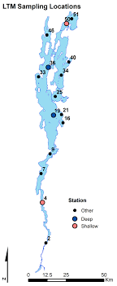
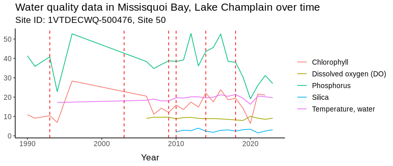
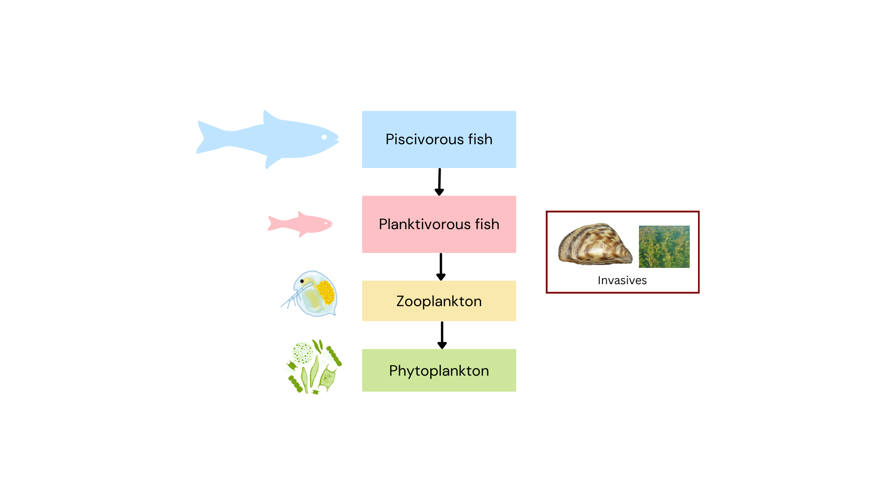
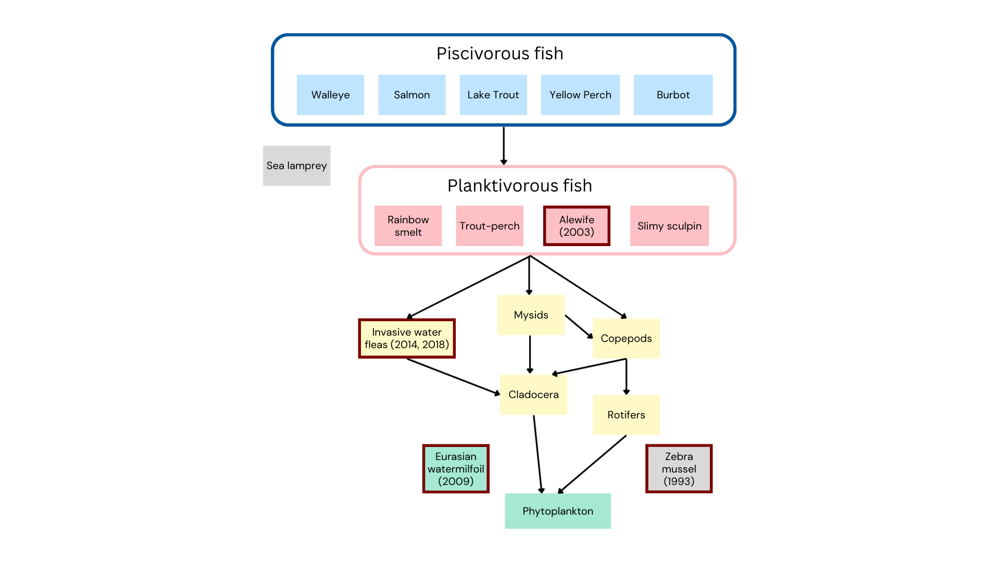

# Stressors, Food Web Connectivity, and Stability

<a href="https://github.com/CU-ESIIL/stressors-food-web-connectivity-stability-innovation-summit-2025__4/edit/main/docs/index.md" title="Edit this page">✏️</a>

<!-- =========================================================
HERO (Swap hero.jpg, title, strapline, and the three links)
========================================================= -->

[Raw photo location: 20200729_145101.jpg](https://github.com/CU-ESIIL/stressors-food-web-connectivity-stability-innovation-summit-2025__4/blob/main/docs/assets/20200729_145101.jpg)
Photo Credit: Symons Lab, UCI

**One sentence on impact:** In three days, we probe how interacting stressors rewire aquatic food-web connections and highlight stability signals that managers can act on.

**[Project brief (PDF)](assets/Seven%20ways%20to%20measure%20fire%20polygon%20velocity-4.pdf) · [View shared code](https://github.com/CU-ESIIL/stressors-food-web-connectivity-stability-innovation-summit-2025__4/blob/main/code/fired_time_hull_panel.ipynb) · [Explore data](https://github.com/CU-ESIIL/stressors-food-web-connectivity-stability-innovation-summit-2025__4/blob/main/code/prism_quicklook.py)**

> **About this site:** This is a public, in-progress record of a 3-day project at the Innovation Summit. Edit everything here in your browser: open a file → pencil icon → Commit changes.

---

## How to use this page (for the team)
- **Edit this file:** `docs/index.md` → ✎ → change text → **Commit changes**.
- **Add images:** upload to `docs/assets/` and reference like `assets/your_file.png`.
- Keep **text short** and **visuals first**. Think “slide captions,” not essays.

---

## Day 1 — Define & Explore
*Focus: questions, hypotheses, context; add at least one visual (photo of whiteboard/notes).*

### Our product 📣
- Future publication
- Conceptual progress towards an ESIIL Working Group application

### Our question(s) 📣
- How do multiple stressors impact food web connectivity in aquatic systems, and at what threshold of connectivity do we pass a tipping point?
- Can food web connectivity be used as a predictor of tipping points?
- Does relative abundance at each trophic level signal tipping points?

### Hypotheses / intentions [Optional: probably not relevant if you are creating an educational tool]
- If the number of food web connections approximates stability, then loss of some number of connections over a threshold will result in a significantly different food web composition.
- Addition of multiple stressors will lead to a switch in trophic cascade structure (bottom-up versus top-down systems).
- Addition of multiple stressors will shift food webs to contain a higher proportion of generalist species. 

### Why this matters (the “upshot”) 📣
Aquatic places have a lot of value - food, recreation, biodiversity, and more. Freshwater lakes are under threat from multiple stressors including changing temperatures, pH, nutrients, invaisve species, and human impact, which threaten those values.

### Inspirations (papers, datasets, tools)
- Vermont Department of Environmental Conservation/EPA water quality datasets: [Lake Champlain data](https://anrweb.vermont.gov/dec/_dec/LongTermMonitoringLakes.aspx?_gl=1*1gvj1mr*_ga*ODAxMzU1NjYwLjE3NTg2NTY5NTk.*_ga_V9WQH77KLW*czE3NTg2NTY5NTkkbzEkZzEkdDE3NTg2NTcyNzYkajYwJGwwJGgw)

### Field notes / visuals
<!-- EDIT: Replace with a real smartphone photo or sketch; keep filename simple. -->

[Raw photo location: day1_whiteboard.jpg](https://github.com/CU-ESIIL/stressors-food-web-connectivity-stability-innovation-summit-2025__4/blob/main/docs/assets/whiteboard_9-23-25.jpg)
*Initial whiteboard brainstorm of a basic foodweb*

> **Different perspectives:** Briefly capture disagreements or alternate framings. These can unlock innovation.

---

## Day 2 — Data & Methods
*Focus: what we’re testing and building; show a first visual (plot/map/screenshot/GIF).*

### Data sources we’re exploring 📣

[Raw photo location: LakeChamplainMap.png](https://github.com/CU-ESIIL/stressors-food-web-connectivity-stability-innovation-summit-2025__4/blob/main/docs/assets/LakeChamplainMap.png)

<!-- EDIT: Link each source; add size/notes if relevant. -->
- Vermont Department of Environmental Conservation/EPA water quality datasets: [Lake Champlain data](https://anrweb.vermont.gov/dec/_dec/LongTermMonitoringLakes.aspx?_gl=1*1gvj1mr*_ga*ODAxMzU1NjYwLjE3NTg2NTY5NTk.*_ga_V9WQH77KLW*czE3NTg2NTY5NTkkbzEkZzEkdDE3NTg2NTcyNzYkajYwJGwwJGgw) Physical, chemical, and biological observations including nutrients, temperature, pH, dissolved oxygen, and biological species
-EPA Great Lakes Data repository GLENDA: [Great Lakes Data Repository] (https://cdxapps.epa.gov/cdx-glenda/action/querytool/querySystem)

### Methods / technologies we’re testing 📣
- Parameterize a simulated food web using observed data from Lake Champlain.
- In simulated model, introduce stressors such as changes to temperature, pollution (e.g., nutrients), invasive species, etc.
- Calculate food web metrics such as connectivity, number of nodes, stability, etc. before and after introduction of stressors.
- Determine if and where thresholds exist before food web metrics display food web collapse.

### Challenges identified
**Data gaps / quality issues:**
> 1. Site IDs don't seem to match to consistent locations.
> 2. Site IDs are differen't between the Vermont DEC website and the EPA API (where we actually stream data from), making it difficult to get a handle on what sites we are looking at.
> 3. Zooplankton is missing from the Lake Champlain dataset, which are crucial taxa to include in a freshwater food web.

**Method limitations / compute constraints**
> 1. How do we make a basic, but also realistic, simulated food web to test effects of stressors?

**Open questions we need to decide on**
> 1. How complex of a food web do we simulate?
> 2. Which stressors do we include in the system?
> 3. Do we expand outside of Lake Champlain? If so, where do we find those data?

### Visuals
<!-- EDIT: Swap examples; keep file sizes modest. -->
#### Static figure

[Raw photo location: lc_water_quality.png](https://github.com/CU-ESIIL/stressors-food-web-connectivity-stability-innovation-summit-2025__4/blob/main/docs/assets/lc_water_quality.png)
*Figure 1.* Snapshot showing water quality over time at a pilot station.

[Raw photo location: lc_water_quality.png](https://github.com/CU-ESIIL/stressors-food-web-connectivity-stability-innovation-summit-2025__4/blob/main/docs/assets/Site50_WaterQualityPlusInvasions)
*Figure 2.* Water quality over time at a shallow water station. Vertical red dashed lines indicate biological invasions.

[Raw photo location: lc_water_quality.png](https://github.com/CU-ESIIL/stressors-food-web-connectivity-stability-innovation-summit-2025__4/blob/main/docs/assets/very_simple_foodweb.png)
*Figure 3.* Simple food web relevant to most freshwater lake systems with common Lake Champlain invasive species.

[Raw photo location: lc_water_quality.png](https://github.com/CU-ESIIL/stressors-food-web-connectivity-stability-innovation-summit-2025__4/blob/main/docs/assets/moderate_complexity_foodweb.png)
*Figure 4.* Slightly more complex food web specific to Lake Camplain and many other freshwater lakes. Year of introduction of invasive species labeled in parantheses.

#### Interactive map (iframe)
<iframe
  title="Study area (OpenStreetMap)"
  src="https://www.openstreetmap.org/export/embed.html?bbox=-105.35%2C39.90%2C-105.10%2C40.10&layer=mapnik&marker=40.000%2C-105.225"
  width="100%" height="360" frameborder="0"></iframe>

<a href="https://www.openstreetmap.org/?mlat=40.000&mlon=-105.225#map=12/40.0000/-105.2250">Open full map</a>

> If an embed doesn’t load, put the normal link directly under it.

---

## Final Share Out — Insights & Sharing 
*Focus: synthesis; highlight 2–3 visuals that tell the story; keep text crisp. Practice a 2-minute walkthrough of the homepage 📣: Why → Questions → Data/Methods → Findings → Next.*

[Raw photo location: team_photo.jpg](https://github.com/CU-ESIIL/stressors-food-web-connectivity-stability-innovation-summit-2025__4/blob/main/docs/assets/team_photo.jpg)

### Findings at a glance 📣
- Freshwater lakes provide important values to humans and ecosystems. It is imperative that resource managers understand food webs and the threats that can alter them.
- Lake Champlain has multiple stressors acting on food webs including warming temperatures, nutrient inputs, and invasive species introductions.
- Invasive species invasions can be detected from figures
- Scale matters! E.g., phosphorus varies at different depths.

### What’s next? 📣
- Aquire more relevant data (e.g., zooplankton data from collaborator)
- Harmonize data
- Identify all stressors that affect Lake Champlain
- Refine scope
- Develop ESIIL Working Group application
- Future publication!

---

## Team
| Name | Role | Affiliation | GitHub |
|------|------|---------|--------|
| [Dr. Matt Bitters](https://earthlab.colorado.edu/our-team/matthew-bitters) | TBD | CIRES, CU Boulder | [@matthewbitters](https://github.com/matthewbitters) |
| [Dr. Alyssa Gleichsner](https://www.plattsburgh.edu/academics/schools/arts-sciences/biological-sciences/faculty/gleichsner-alyssa.html) | TBD | SUNY Plattsburgh | [@ParasiticProf](https://github.com/ParasiticProf); [@agleichs](https://github.com/agleichs) |
| [Dr. Harrison Hartle](https://www.santafe.edu/people/profile/harrison-hartle) | TBD | Santa Fe Institute | TBD |
| [Evan Fiorenza](https://www.evan-fiorenza.com/about-me) | TBD | UC Irvine | [@evanfiorenza](https://github.com/evanfiorenza) |
| [Aruni Kadawatha](https://www.researchgate.net/profile/Aruni-Kadawatha-4) | TBD | Case Western Reserve University | [@AruniD0219](https://github.com/AruniD0219) |
| [Ruby Krasnow](https://ruby.science) | TBD | University of Maine | [@rmk118](https://github.com/rmk118) |

---

## Storage

Code
Keep shared scripts, notebooks, and utilities in the [`code/`](https://github.com/CU-ESIIL/stressors-food-web-connectivity-stability-innovation-summit-2025__4/tree/main/code) directory. Document how to run them in a README or within the files so teammates and visitors can reproduce your workflow.

Documentation
Use the [`docs/`](https://github.com/CU-ESIIL/stressors-food-web-connectivity-stability-innovation-summit-2025__4/tree/main/docs) folder to publish project updates on this site. Longer internal notes can live in [`documentation/`](https://github.com/CU-ESIIL/stressors-food-web-connectivity-stability-innovation-summit-2025__4/tree/main/documentation); summarize key takeaways here so the public story stays current.

---

## Cite & reuse
If you use these materials, please cite:

> Innovation Summit Group 4. (2025). *Stressors, Food Web Connectivity, and Stability*. GitHub. https://github.com/CU-ESIIL/stressors-food-web-connectivity-stability-innovation-summit-2025__4

License: CC-BY-4.0 unless noted. See dataset licenses on the **[Data](data.md)** page.

---

<!-- EDIT HINTS
- Upload images to docs/assets/ and reference as assets/filename.png
- Keep images ~1200 px wide; avoid >5–8 MB per file.
- Use short, active sentences; this is a scrolling “slide deck.”
- Update this page at least once per day during the sprint.
-->
