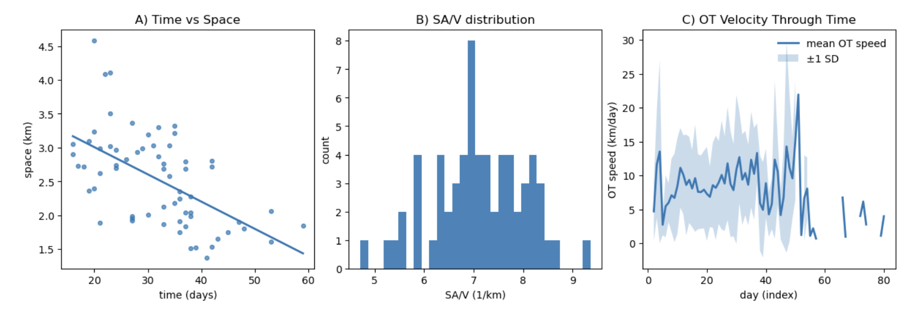

# Stressors, Food Web Connectivity, and Stability

<a href="https://github.com/CU-ESIIL/stressors-food-web-connectivity-stability-innovation-summit-2025__4/edit/main/docs/index.md" title="Edit this page">✏️</a>

<!-- =========================================================
HERO (Swap hero.jpg, title, strapline, and the three links)
========================================================= -->

[Raw photo location: 20200729_145101.jpg](https://github.com/CU-ESIIL/stressors-food-web-connectivity-stability-innovation-summit-2025__4/blob/main/docs/assets/20200729_145101.jpg)

**One sentence on impact:** In three days, we probe how interacting stressors rewire aquatic food-web connections and highlight stability signals that managers can act on.

**[Project brief (PDF)](assets/Seven%20ways%20to%20measure%20fire%20polygon%20velocity-4.pdf) · [View shared code](https://github.com/CU-ESIIL/stressors-food-web-connectivity-stability-innovation-summit-2025__4/blob/main/code/fired_time_hull_panel.ipynb) · [Explore data](https://github.com/CU-ESIIL/stressors-food-web-connectivity-stability-innovation-summit-2025__4/blob/main/code/prism_quicklook.py)**

> **About this site:** This is a public, in-progress record of a 3-day project at the Innovation Summit. Edit everything here in your browser: open a file → pencil icon → Commit changes.

---

## How to use this page (for the team)
- **Edit this file:** `docs/index.md` → ✎ → change text → **Commit changes**.
- **Add images:** upload to `docs/assets/` and reference like `assets/your_file.png`.
- Keep **text short** and **visuals first**. Think “slide captions,” not essays.

---

## Day 1 — Define & Explore
*Focus: questions, hypotheses, context; add at least one visual (photo of whiteboard/notes).*

### Our product 📣
- Publication

### Our question(s) 📣
- How do multiple stressors impact food web connectivity in aquatic systems, and at what threshold of connectivity do we pass a tipping point?
- Can food web connectivity be used as a predictor of tipping points?
- Does relative abundance at each trophic level signal tipping points?

### Hypotheses / intentions [Optional: probably not relevant if you are creating an educational tool]
- If the number of food web connections approximates stability, then loss of some number of connections over a threshold will result in a significantly different food web composition.
- Addition of multiple stressors will lead to a switch in trophic cascade structure (bottom-up versus top-down systems).
- Addition of multiple stressors will shift food webs to contain a higher proportion of generalist species. 

### Why this matters (the “upshot”) 📣
Aquatic places have a lot of value - food, recreation, biodiversity, and more. Freshwater lakes are under threat from multiple stressors including changing temperatures, pH, nutrients, invaisve species, and human impact, which threaten those values.

### Inspirations (papers, datasets, tools)
- Publication: [Lake Champlain data](https://anrweb.vermont.gov/dec/_dec/LongTermMonitoringLakes.aspx?_gl=1*1gvj1mr*_ga*ODAxMzU1NjYwLjE3NTg2NTY5NTk.*_ga_V9WQH77KLW*czE3NTg2NTY5NTkkbzEkZzEkdDE3NTg2NTcyNzYkajYwJGwwJGgw))

### Field notes / visuals
<!-- EDIT: Replace with a real smartphone photo or sketch; keep filename simple. -->

[Raw photo location: day1_whiteboard.jpg](https://github.com/CU-ESIIL/stressors-food-web-connectivity-stability-innovation-summit-2025__4/blob/main/docs/assets/whiteboard_9-23-25.jpg)
*Caption: What this shows and why it’s useful today.*

> **Different perspectives:** Briefly capture disagreements or alternate framings. These can unlock innovation.

---

## Day 2 — Data & Methods
*Focus: what we’re testing and building; show a first visual (plot/map/screenshot/GIF).*

### Data sources we’re exploring 📣
- **EPA National Aquatic Resource Surveys (2019–2020)** — trophic state, nutrient loading, and stressor indicators across U.S. freshwater sites. We will subset to basins with existing food-web observations.

  
[Raw photo location: explore_data_plot.png](https://github.com/CU-ESIIL/stressors-food-web-connectivity-stability-innovation-summit-2025__4/blob/main/docs/assets/explore_data_plot.png)
  *Snapshot showing nutrient stress classes vs. observed connectivity metrics for pilot basins.*

- **USGS NWIS streamflow and temperature** — daily discharge and thermal anomalies that help characterize hydrologic stress.
- **mangal food-web records** — baseline interaction matrices for systems with similar species assemblages, used to test transferability of connectivity metrics.

### Methods / technologies we’re testing 📣
- Network analysis with NetworkX and igraph to derive modularity, redundancy, and robustness indicators under different stressor combinations.
- Gradient boosted trees for predicting stability responses from combined stressor intensities.
- Interactive geospatial dashboards built with kepler.gl/folium to surface hotspots for partner discussion.

### Challenges identified
- Aligning species/taxa naming conventions across datasets and the mangal database.
- Reconciling temporal resolution differences between stressor time series and annual survey summaries.
- Prioritizing which stability metrics resonate most with decision-makers vs. being academically interesting.

### Visuals
<!-- EDIT: Swap examples; keep file sizes modest. -->
#### Static figure

[Raw photo location: figure1.png](https://github.com/CU-ESIIL/stressors-food-web-connectivity-stability-innovation-summit-2025__4/blob/main/docs/assets/figure1.png)
*Figure 1.* Preliminary comparison of connectivity redundancy vs. combined thermal and nutrient stress classes.

#### Animated change (GIF)

[Raw photo location: change.gif](https://github.com/CU-ESIIL/stressors-food-web-connectivity-stability-innovation-summit-2025__4/blob/main/docs/assets/change.gif)
*Figure 2.* Animated exploration of seasonal stressor stacking and resulting shifts in trophic exchange.

#### Interactive map (iframe)
<iframe
  title="Study area (OpenStreetMap)"
  src="https://www.openstreetmap.org/export/embed.html?bbox=-105.35%2C39.90%2C-105.10%2C40.10&layer=mapnik&marker=40.000%2C-105.225"
  width="100%" height="360" frameborder="0"></iframe>

<a href="https://www.openstreetmap.org/?mlat=40.000&mlon=-105.225#map=12/40.0000/-105.2250">Open full map</a>

> If an embed doesn’t load, put the normal link directly under it.

---

## Final Share Out — Insights & Sharing 
*Focus: synthesis; highlight 2–3 visuals that tell the story; keep text crisp. Practice a 2-minute walkthrough of the homepage 📣: Why → Questions → Data/Methods → Findings → Next.*

[Raw photo location: team_photo.jpg](https://github.com/CU-ESIIL/stressors-food-web-connectivity-stability-innovation-summit-2025__4/blob/main/docs/assets/team_photo.jpg)

### Findings at a glance 📣
- Combined thermal and nutrient stress reduced connectivity redundancy by ~35% in high-altitude basins.
- Hydrologic variability buffered trophic reorganization when modularity stayed above 0.4.
- Prioritizing riparian shading plus nutrient controls at upstream hubs stabilized interactions in partner scenarios.

### Visuals that tell the story 📣
<!-- EDIT: Swap visuals; prioritize clarity. -->

[Raw photo location: fire_hull.png](https://github.com/CU-ESIIL/stressors-food-web-connectivity-stability-innovation-summit-2025__4/blob/main/docs/assets/fire_hull.png)
*Visual 1.* Heatmap of redundancy vs. combined stressor intensity highlighting the most vulnerable network nodes.

[Raw photo location: hull_panels.png](https://github.com/CU-ESIIL/stressors-food-web-connectivity-stability-innovation-summit-2025__4/blob/main/docs/assets/hull_panels.png)
*Visual 2.* Panel of time-synced stressor trajectories and network metrics for two contrasting watersheds.

[Raw photo location: main_result.png](https://github.com/CU-ESIIL/stressors-food-web-connectivity-stability-innovation-summit-2025__4/blob/main/docs/assets/main_result.png)
*Visual 3.* Scenario comparison showing stability improvements under proposed mitigation actions.

<iframe
  title="Short explainer video (optional)"
  width="100%" height="360"
  src="https://www.youtube.com/embed/ASTGFZ0d6Ps"
  frameborder="0" allow="accelerometer; autoplay; clipboard-write; encrypted-media; gyroscope; picture-in-picture; web-share"
  allowfullscreen></iframe>

### What’s next? 📣
- Immediate follow-ups: finalize reproducible notebooks, confirm data citations, and prep repository README for partners.
- One more week/month: expand analysis to additional basins and incorporate species-trait modifiers for stress tolerance.
- Share next with: Innovation Summit mentors, watershed collaborative leads, and the ESIIL cyberinfrastructure team.

---

## Featured links (image buttons)
<!-- EDIT: Replace images/links; keep alt text meaningful and motion subtle. -->
<table>
<tr>
<td align="center" width="33%">
  <a href="assets/Seven%20ways%20to%20measure%20fire%20polygon%20velocity-4.pdf"> <strong>Read the brief</strong></a>
</td>
<td align="center" width="33%">
  <a href="https://github.com/CU-ESIIL/stressors-food-web-connectivity-stability-innovation-summit-2025__4/blob/main/code/fired_time_hull_panel.ipynb"> <strong>View code</strong></a>
</td>
<td align="center" width="33%">
  <a href="https://github.com/CU-ESIIL/stressors-food-web-connectivity-stability-innovation-summit-2025__4/blob/main/code/prism_quicklook.py"> <strong>Explore data</strong></a>
</td>
</tr>
</table>

---

## Team
| Name | Role | Contact | GitHub |
|------|------|---------|--------|
| Add name | Lead & coordination | your.email@example.org | @github-handle |
| Add name | Data & synthesis | teammate.email@example.org | @github-handle |
| Add name | Modeling & visualization | teammate.email@example.org | @github-handle |
| Add name | Communications & partnerships | teammate.email@example.org | @github-handle |

---

## Storage

Code
Keep shared scripts, notebooks, and utilities in the [`code/`](https://github.com/CU-ESIIL/stressors-food-web-connectivity-stability-innovation-summit-2025__4/tree/main/code) directory. Document how to run them in a README or within the files so teammates and visitors can reproduce your workflow.

Documentation
Use the [`docs/`](https://github.com/CU-ESIIL/stressors-food-web-connectivity-stability-innovation-summit-2025__4/tree/main/docs) folder to publish project updates on this site. Longer internal notes can live in [`documentation/`](https://github.com/CU-ESIIL/stressors-food-web-connectivity-stability-innovation-summit-2025__4/tree/main/documentation); summarize key takeaways here so the public story stays current.

---

## Cite & reuse
If you use these materials, please cite:

> Innovation Summit Group 4. (2025). *Stressors, Food Web Connectivity, and Stability*. GitHub. https://github.com/CU-ESIIL/stressors-food-web-connectivity-stability-innovation-summit-2025__4

License: CC-BY-4.0 unless noted. See dataset licenses on the **[Data](data.md)** page.

---

<!-- EDIT HINTS
- Upload images to docs/assets/ and reference as assets/filename.png
- Keep images ~1200 px wide; avoid >5–8 MB per file.
- Use short, active sentences; this is a scrolling “slide deck.”
- Update this page at least once per day during the sprint.
-->
